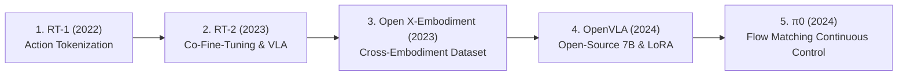

# Vision-Language-Action (VLA) & Robot Foundation Models: Evolutionary Roadmap

> **VLA 및 로봇 파운데이션 모델의 발전 흐름과 핵심 논문 정리**  
> 본 문서는 RT-1부터 $\pi_0$(pi-zero)까지 로봇 행동 제어와 파운데이션 모델의 결합 과정을 정리한 스터디 및 연구용 로드맵 문서입니다.

---

## 📌 Overview

최근 로보틱스 분야는 자연어 및 시각 지능(VLM)과 로봇 물리적 제어(Action)를 결합한 **Vision-Language-Action (VLA)** 모델을 중심으로 급격히 진화하고 있습니다. 초기 이산적 토큰화(Discrete Action Tokenization) 방식에서 시작하여, 인터넷 규모의 사전학습 웹 데이터 융합, 교차 형태(Cross-Embodiment) 학습, 그리고 고주파수 연속 제어(Continuous Flow Matching)로 이어지는 핵심 논문의 흐름을 다룹니다.

---

## 🚀 VLA 모델 진화 흐름 (Chronological Flow)

### 1. RT-1 (Robotics Transformer 1) — 2022
* **핵심 개념**: 로봇의 물리적 제어 명령(Arm/Base displacement)을 이산적(Discrete) 토큰으로 변환하여 **시퀀스 모델링(Transformer)**에 적용한 효시적 모델.
* **아키텍처**:
  * Vision: ImageNet으로 사전학습된 EfficientNet-B3 + FiLM (언어 임베딩 융합)
  * Token Reduction: TokenLearner (시각 토큰 수 축소)
  * Action Generation: Decoder-only Transformer (35M parameters, 3Hz 제어)
* **의의**: 로봇 행동을 자연어 토큰처럼 처리하여 대규모 이민테이션 학습(Imitation Learning)을 성공적으로 수행함.

### 2. RT-2 (Robotics Transformer 2) — 2023
* **핵심 개념**: 웹 스케일 VLM(PaLI-X, PaLM-E)의 사전학습 가중치를 동결하지 않고, 로봇 궤적 데이터와 **Co-Fine-Tuning**하여 창발적 추론(Emergent Reasoning) 능력을 획득한 VLA.
* **아키텍처 & 기법**:
  * Action representation: 로봇의 연속적 관절/위치 값을 256개 bin으로 나누어 기존 VLM의 텍스트 토큰에 매핑 (Symbol Tuning).
  * Web + Robot Data: 인터넷 VQA 데이터와 로봇 궤적 데이터를 함께 미세조정.
* **의의**: 로봇이 학습 데이터에 없던 물체를 추론(예: "가장 건강한 음료 집기")하고 명령을 이행하는 Zero-shot 일반화 실현.

### 3. Open X-Embodiment (RT-X) — 2023
* **핵심 개념**: 세계 21개 기관이 협력하여 22개 서로 다른 로봇 형태(Embodiments), 100만 개 이상의 궤적(Trajectories) 데이터를 통합한 **표준화 데이터셋(RLDS 포맷) 및 Cross-Embodiment 학습**.
* **대표 모델**: RT-1-X, RT-2-X (55B)
* **의의**: 단일 로봇 데이터에 의존하던 한계를 넘어, 이종 로봇 간 긍정적 지식 전이(Positive Transfer)를 입증함.

### 4. OpenVLA — 2024
* **핵심 개념**: 97만 개 로봇 에피소드로 학습된 **7B 파라미터급 오픈소스 VLA 모델**.
* **아키텍처**:
  * Visual Encoder: SigLIP + DINOv2 (공간 추론 및 시각 특징 융합)
  * LLM Backbone: Llama 2 (7B)
* **의의**: Closed 모델(RT-2-X 등) 대비 뛰어난 성능을 보이며, **LoRA(Rank 32)** 및 Quantization을 지원하여 단일 consumer-grade GPU(A100 등)에서도 10~15시간 내에 파인튜닝이 가능하도록 로봇 파운데이션 연구의 진입장벽을 낮춤.

### 5. $\pi_0$ (pi-zero) — 2024
* **핵심 개념**: Autoregressive 이산 토큰 방식의 속도/표현력 한계를 극복하기 위해 **Conditional Flow Matching (Diffusion 기반)**을 도입한 최신 로봇 파운데이션 모델.
* **아키텍처**:
  * Base VLM: PaliGemma (3B)
  * Action Expert: Flow Matching 디퓨전 프로세스를 통해 고주파수(최대 50Hz) 연속 행동 궤적(Action Chunking) 생성.
* **의의**: 빨래 접기, 상자 조립 등 섬세하고 정교한(Dexterous) 양팔 연속 제어 작업에서 SOTA 달성.

---

## 📊 모델별 핵심 비교 (Summary Table)

| 모델명 | 발표 연도 | 주요 개발 주체 | 파라미터 규모 | 시각/언어 백본 | 행동 표현 방식 (Action Format) | 특징 및 의의 |
| :--- | :---: | :--- | :---: | :--- | :--- | :--- |
| **RT-1** | 2022 | Google / Everyday Robots | 35M | EfficientNet-B3 + FiLM | Discretized Tokens (256 bins, 3Hz) | Action Tokenization 개념 정립 |
| **RT-2** | 2023 | Google DeepMind | PaLI-X (55B) / PaLM-E (12B) | PaLI-X / PaLM-E | Text-encoded Action Tokens | Co-fine-tuning을 통한 Emergent Semantic Reasoning |
| **RT-X** | 2023 | Open X-Embodiment Collab. | 35M ~ 55B | EfficientNet / ViT + UL2 | Normalized Discretized Actions | 22종 로봇 100만+ 에피소드 통합 및 Positive Transfer |
| **OpenVLA** | 2024 | OpenVLA Team (Stanford 등) | 7B | SigLIP + DINOv2 + Llama 2 | Discretized Action Tokens | SOTA 오픈소스 VLA, LoRA 기반 효율적 미세조정 |
| **$\pi_0$** | 2024 | Physical Intelligence | ~3B+ | PaliGemma + Action Expert | Continuous Flow Matching (최대 50Hz) | 디퓨전 기반 고주파수 continuous action chunking |

---

## 📚 References & Source List (출처 목록)

| No. | 논문 제목 (Title) | 게재/발표년도 | 주요 링크 / ArXiv ID | 비고 / 핵심 기여 |
| :-: | :--- | :-: | :--- | :--- |
| **1** | **RT-1: Robotics Transformer 1** | 2022 | [arXiv:2212.06817](https://arxiv.org/abs/2212.06817) | Efficient Transformer 기반 실시간 로봇 제어 |
| **2** | **RT-2: Vision-Language-Action Models Transfer Web Knowledge to Robotic Control** | 2023 | [arXiv:2307.15818](https://arxiv.org/abs/2307.15818) | VLA 개념 정립 및 웹 지식의 로봇 제어 전이 |
| **3** | **Open X-Embodiment: Robotic Learning Datasets and RT-X Models** | 2023 | [arXiv:2310.08864](https://arxiv.org/abs/2310.08864) | 대규모 교차 형태 데이터셋 및 RT-X 모델 |
| **4** | **OpenVLA: An Open-Source Vision-Language-Action Model** | 2024 | [arXiv:2406.09246](https://arxiv.org/abs/2406.09246) | 7B 오픈소스 VLA 및 LoRA 미세조정 검증 |
| **5** | **$\pi_0$: A Vision-Language-Action Flow Model for General Robot Control** | 2024 | [arXiv:2410.24164](https://arxiv.org/abs/2410.24164) | Flow matching 기반 고주파수 연속 로봇 제어 |
